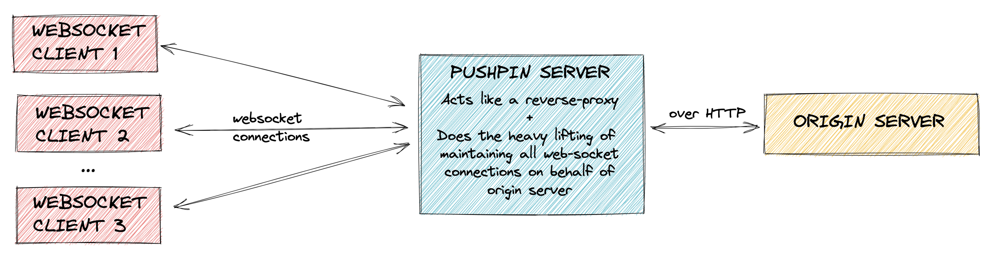

### App to broadcast events to websocket clients via Pushpin   

--------
#### Architecture Diagram :




#### To start the origin server

```
make up
```
-------
#### Pushpin routes file:

```
* localhost:8080,over_http
```
-------
#### Sample client repo at : https://github.com/PankhudiB/websocket-client

Client request to subscribe to `test` channel:

> websocat -v ws://localhost:7999/subscribe
-------

#### To publish event to `test` channel for clients connected through `websocket` protocol :


Through Pushpin's HTTP endpoint :

```
curl -d '{ "items": [ { "channel": "test", "formats": {
    "ws-message": { "content": "hello there\n" } } } ] }' \
    http://localhost:5561/publish/
```

OR 

Through origin-server - that internally triggers HTTP endpoint of pushpin: 
```
curl -v --data "updated_state via HTTP" http://localhost:8080/publish
```

Through origin-server - that internally uses ZEROMQ to publish the data:
```
curl -v --data "updated_state via ZMQ" http://localhost:8080/publish-on-zmq
```
-------